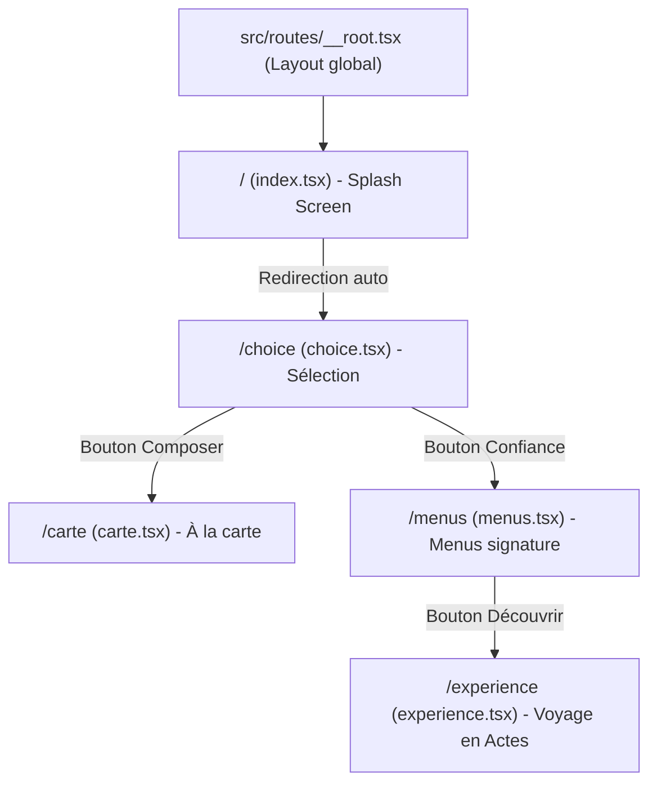

# Architecture du Projet : L'AMI — Sofitel Bénin

Ce document décrit en détail l'architecture technique, la structure des dossiers et les choix technologiques du projet **L'AMI — Sofitel Bénin**.

---

## 1. Vue d'Ensemble & Stack Technique

Le projet est un site web immersif et haut de gamme présentant le concept gastronomique du restaurant **L'AMI** du Sofitel Bénin, orchestré par la Cheffe Georgiana Viou. C'est une application web moderne full-stack optimisée pour le rendu côté serveur (SSR) et l'interactivité côté client (CSR).

### Stack Principale :
*   **Framework Full-stack** : [TanStack Start](https://tanstack.com/router/v1/docs/start/overview) (React 19 + TanStack Router).
*   **Bundler & Dev Server** : [Vite 8](https://vitejs.dev/).
*   **Serveur de Production / SSR** : [Nitro](https://nitro.unjs.io/) (configuré via Lovable pour un déploiement cloud, par exemple Cloudflare).
*   **Gestionnaire de Paquets** : [Bun](https://bun.sh/) (avec `bun.lock` et `bunfig.toml`).
*   **Langage** : TypeScript.
*   **Stylisation** : Tailwind CSS v4 (`@tailwindcss/vite`).
*   **Composants UI** : Composants primitifs [Radix UI](https://www.radix-ui.com/) stylisés avec Tailwind CSS (style shadcn/ui).
*   **Gestion d'État / Requêtes** : TanStack React Query v5.
*   **Validation de Données** : Zod.

---

## 2. Structure des Dossiers du Projet

Voici l'organisation des fichiers sources dans le dossier `/src` :

```text
src/
├── assets/                  # Images statiques (plats, photos de la Cheffe, etc.)
├── components/
│   └── ui/                  # Composants d'interface réutilisables (Boutons, Cartes, etc.)
├── hooks/
│   └── use-mobile.tsx       # Hook utilitaire pour la détection du format mobile
├── lib/
│   ├── error-capture.ts     # Capture globale des erreurs SSR
│   ├── error-page.ts        # Rendu HTML de la page d'erreur de secours
│   ├── lovable-error-reporting.ts # Intégration de rapports d'erreurs pour Lovable
│   └── utils.ts             # Fonctions utilitaires (fusion de classes Tailwind, etc.)
├── routes/                  # Définition des pages et routes (File-based Routing)
│   ├── __root.tsx           # Layout racine globale (en-tête HTML, polices, polices de secours)
│   ├── index.tsx            # Écran d'accueil / Splash screen de chargement
│   ├── choice.tsx           # Page de sélection du mode (Carte vs Menus)
│   ├── carte.tsx            # Page interactive "À la Carte" (sélections et tarifs XOF)
│   ├── menus.tsx            # Présentation des menus signatures (4, 5 ou 7 étapes)
│   └── experience.tsx       # Page de narration immersive "En Actes" du repas
├── routeTree.gen.ts         # Arbre des routes généré automatiquement par TanStack Router
├── router.tsx               # Configuration et initialisation du routeur (QueryClient, scroll)
├── server.ts                # Point d'entrée serveur (Nitro SSR) avec gestion des erreurs
├── start.ts                 # Middleware serveur et initialisation de TanStack Start
└── styles.css               # Fichier CSS global & configuration du thème Tailwind v4
```

---

## 3. Système de Routing & Pages

Le projet utilise le système de **routing basé sur les fichiers** (file-based routing) de TanStack Router. Chaque fichier dans `src/routes/` correspond à une URL.

### Cartographie des Routes :



*   **`__root.tsx`** : Enveloppe toute l'application. Elle gère l'injection des polices d'écriture (Google Fonts *Cormorant Garamond* et *Cormorant SC*), lie le fichier CSS global, fournit le contexte `QueryClient` et configure les composants d'erreur globaux (404 et 500).
*   **`index.tsx` (Route `/`)** : Affiche une page de garde animée avec un chargement simulé qui redirige automatiquement l'utilisateur vers `/choice`.
*   **`choice.tsx` (Route `/choice`)** : Offre deux choix de navigation : composer sa propre sélection (Carte) ou se laisser guider (Menus).
*   **`carte.tsx` (Route `/carte`)** : Une page de sélection de plats organisée par catégories avec un panier persistant en bas de l'écran affichant le total en Francs CFA (XOF).
*   **`menus.tsx` (Route `/menus`)** : Affiche les menus signatures en étapes (Découverte en 4 étapes, Dégustation en 7 étapes, Végétarien en 5 étapes).
*   **`experience.tsx` (Route `/experience`)** : Permet de parcourir les différents plats d'un menu sous forme d'Actes interactifs avec des détails sur les ingrédients, leur origine et des messages de la Cheffe.

---

## 4. Système de Design (CSS & Tailwind v4)

Le projet utilise **Tailwind CSS v4** qui apporte une nouvelle architecture de configuration simplifiée directement dans le fichier CSS.

### Configuration du Thème (`src/styles.css`) :
Tailwind v4 utilise la directive `@theme inline` au lieu du fichier `tailwind.config.js`. Le thème est basé sur le modèle de couleurs **oklch**, idéal pour des dégradés lisses et des couleurs éclatantes sur les écrans modernes.

*   **Variables de Thème** : Déclarées sous `:root` (thème clair) et `.dark` (thème sombre), elles sont mappées à des classes CSS d'utilité via `@theme`.
*   **Esthétique Visuelle** :
    *   **Couleurs dominantes** : Tons chauds, sombres et luxueux comme le marron/noir (`#0a0604`, `#1a1410`) et le doré/laiton (`#c9a96a`, `#e9dcc4`).
    *   **Typographie** : Utilisation de polices avec empattement (serif) élégantes pour une image de marque haut de gamme.

---

## 5. Gestion des Erreurs et Robustesse

Le projet intègre une gestion des erreurs robuste particulièrement étudiée pour le rendu côté serveur (SSR) :

1.  **`src/lib/error-capture.ts`** : Capture les erreurs non gérées au niveau du serveur pour éviter les crashs silencieux ou les fuites de mémoire.
2.  **`src/lib/error-page.ts`** : Génère une page HTML statique de secours en cas d'erreur de rendu serveur critique.
3.  **`src/server.ts`** : Enveloppe le point d'entrée Nitro pour intercepter les exceptions du serveur de rendu et renvoyer la page d'erreur propre avec le statut HTTP 500.
4.  **`src/lib/lovable-error-reporting.ts`** : Transmet les détails des erreurs au SDK Lovable pour faciliter le débogage en production.

---

## 6. Build et Déploiement

Le projet utilise le moteur **Nitro** intégré à TanStack Start pour compiler l'application en un serveur autonome très léger.

### Scripts de développement :
*   `bun dev` / `npm run dev` : Démarre le serveur de développement Vite avec rechargement à chaud.
*   `bun build` / `npm run build` : Génère le build de production optimisé (SSR + Client static assets).
*   `bun preview` / `npm run preview` : Lance une prévisualisation locale du build de production.
